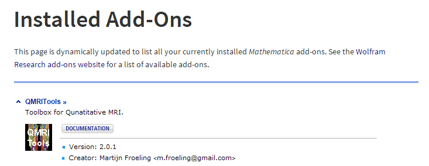
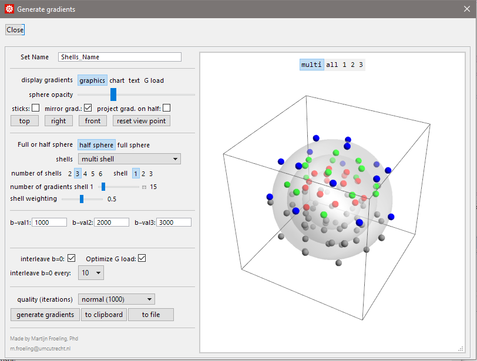

# Summary
``QMRITools`` is written in Mathematica using Workbench and Eclipse and contains a collection of tools and functions for processing quantitative MRI data. The toolbox does not provide a GUI and its primary goal is to allow for fast and batch data processing, and facilitate development and prototyping of new functions. The core of the toolbox contains various functions for data manipulation and restructuring. 

The toolbox includes some [demo data](https://github.com/mfroeling/QMRITools/tree/master/DemoAndTest) which is used in the [demo file](https://github.com/mfroeling/QMRITools/blob/master/DemoAndTest/demo.nb) ``demo.nb``. In this notebook most of the functionality of the toolbox is demonstrated. A full list of functions and packages can be found in the [file](https://github.com/mfroeling/QMRITools/blob/master/QMRITools/All-Functions.nb) ``All-Functions.nb``. For all functions and toolboxes help files and guides are available and the documentation is build such that is incorporated in the Wolfram documentation.  

	 
The library of functions grows along with the research it is used for and started as a toolbox to analyze DWI data of mulsce (@Froeling2012). The toolbox works along side other software packages (e.g. [vIST/e](http://bmia.bmt.tue.nl/software/viste/), and [ITKSnap](http://www.itksnap.org/pmwiki/pmwiki.php)) and for some functionality it calls external executables (e.g. [dcm2nii](https://www.nitrc.org/projects/dcm2nii/) and [Elastix](http://elastix.isi.uu.nl/)). The toolbox has been used is various studies (e.g. @Froeling2012, @Hooijmans2015, @Froeling2015).

The toolbox contains some basic functionality such as DICOM and Nifti import, and 2D,3D and 4D data visualization. The advanced features comprise data registration (@Klein2010, @Shamonin2013), Noise suppression (@Aja-Fernandez2008, @Veraart2015), Diffusion drift correction (@Vos2014), gradient direction optimization (@Froeling2016), simulation framework (@Froeling2013), EPG based T2 fitting (@Marty2016 @Weigel2015) and IDEAL Dixon reconstruction (@Reeder2005 @Herraez2002). The current functional toolboxes with a short description are listed below.

## CardiacTools
A collection of tools to analyze cardiac data. The main features are cardiac shape analysis which allows to define the hard in a local myocardial coordinate system which allow to quanify and analyse data. When the cardiac geometry is know there are functions to analyze qMRI parameters in the AH17 model (@Cerqueira2002) or perform transmural sampleing of qMRI parameters. 
Most of the functionality is demonstrated in the `demo.nb`.

## CoilTools
A collection of tools to evaluate complex multi-coil data. The functions are specific for analysis of multi-coil magnitude and noise data which allow to quantify per channel SNR. Furthermore, if complex coil sensitivity maps are available it allows to perform SENSE g-factor maps simulations.   
This toolbox is not demonstrated in the `demo.nb`.

## DenoiseTools
The toobox provides two algorithms that allow denoising of DWI data. The first is based on and LMMSE framework (@Aja-Fernandez2008) and the second is based on a random matrix theory and Principal component analysis framework (@Veraart2015, @Veraart2016). Furthrmore it provides a anisotropic filter for denoising the estimated diffusion tensor which provides more reliable fiber orientation analysis (@JeeEunLee).
Most of the functionality is demonstrated in the `demo.nb`.

## DixonTools
An IDEAL based Dixon reconstruction algorithm (@Reeder2005, @Yu2008). The method provides multi-peak fitting B0field and T2* correction. The toolbox also provide a function for unwrapping phase data in 2D and 3D based on a best path method (@Abdul-Rahman2007, @Herraez2002). It also contains a function that allows to simulate gradient echo dixon data.
Most of the functionality is demonstrated in the `demo.nb`.

## ElastixTools
A wrapper that calls the Elastix registration framework (@Klein2010, @Shamonin2013). The toolbox determines what registration or transformations need to be performed, exports the related data to a temp folder and calls an automatically generated command line script that performs the registration. After registration is completed the data is again loaded in Mathematica. 
Most of the functionality is demonstrated in the `demo.nb`.

## GeneralTools
This toobox provides core functions used in many other functions and features. The functions comprises amongst others: data cropping, mathematical and statistical operators that ignore zero values, and data rescaling, transformation and padding.
Most of the functionality is demonstrated in the `demo.nb`.

## GradientTools
The main feature is an algorithm that uses static repulsion (@Jones1999, @Froeling2016) to generate homogeneously distributed gradiet directions for DWI experiments. It also provides functions to convert bval and bvec files to bmatrix and vice versa. 
Most of the functionality is demonstrated in the `demo.nb`.

## ImportTools
Allows to import dcm data or dcm header atributes. These functions are rarely used since the toolbox mostly uses the nifty data format and provides tools to convert dcm to nifty via [dcm2niix](https://github.com/rordenlab/dcm2niix).
This toolbox is not demonstrated in the `demo.nb`.

## IVIMTools
The toolbox comprises functions to perform IVIM fitting of DWI data. There are two main functions, non linear fitting and Bayesian fitting (@Orton2014). 
Some of the functionality is demonstrated in the `demo.nb`.

## JcouplingTools
A toolbox that allows simulation of NMR spectra using Hamiltonians based on methods from [FID-A](https://github.com/CIC-methods/FID-A). It allows to simulate large spin systems (@Castillo2011) and was mainly implemented to investigate fat spectra in TSE (@Stokes2013).   
Most of the functionality is demonstrated in the `demo.nb`.

## MaskingTools
Tools for masking and homogenization of data. It provides functions for smoothing cutting and merging masks and functions for the evaluation of data within masks. 
Most of the functionality is demonstrated in the `demo.nb`.

## NiftiTools
Import and export of the nifti file format. Part of the code is based on previously implemented [nii-converter](https://github.com/tomdelahaije/nifti-converter). For converting dicom data to the nifti file format the toolbox uses [dcm2niix](https://github.com/rordenlab/dcm2niix/releases). It also provides some specialized nifti import functions for specific experiments which are probably not generalizable.
Most of the functionality is demonstrated in the `demo.nb`.

## PhysiologyTools
Functions for importing and analyzing philips physiology logging and respiract trace files. The functions are rarly used and not wel supported.
This toolbox is not demonstrated in the `demo.nb`.

## PlottingTools
A variety of functions for visualization of various data types. The main functions are 'PlotData' and 'PlotData3D' which allow to view 2D, 3D and 4D data.  
Most of the functionality is demonstrated in the `demo.nb`.

## ProcessingTools
The toolbox comprises a variety of functions that allow data manipulation and analysis. The main functions allow to join multiple data-sets into one continuous data-set (@froeling2015) or to split data of two legs into two separate data-sets. Furthermore, it contains a collection of functions for data evaluation and analysis.
Most of the functionality is demonstrated in the `demo.nb`.

## RelaxometryTools
A collection of tools to fit T2, T2*, T1rho and T1 relaxometry data. The main function of this toolbox is an extende phase graph (EPG) (@Weigel2015) method for multi-compartment T2 fitting of multi-echo spin echo data (@Marty2016). Therefore it provides function to simulate and evaluate EPG. 
Some of the functionality is demonstrated in the `demo.nb`.

## SimulationTools
The main purpose of this toolbox is to simulate DTI based DWI data and contains some functions to easaly perform analysis of the fit results of the simulated signals (@Froeling2013)  
Some of the functionality is demonstrated in the `demo.nb`.

## TensorTools
The original toolbox where the project started. The main functions in this toolbox are to fit and evaluate the diffusion tensor model. Various fitting methods are implemented (e.g. LLS, NLS, WLLS, and iWLLS), the default method is an iterative weighted linear least squares approach (@Veraart2013). The tensor fitting also includes outlier detections using REKINDLE (@Tax2015) and data preperation inclues drift correction (@Vos2014).
Most of the functionality is demonstrated in the `demo.nb`.

## VisteTools
Import and export functions for tensor data which can be used in the [vIST/e](http://bmia.bmt.tue.nl/software/viste/) tractography tool.  
Most of the functionality is demonstrated in the `demo.nb`.

# References
